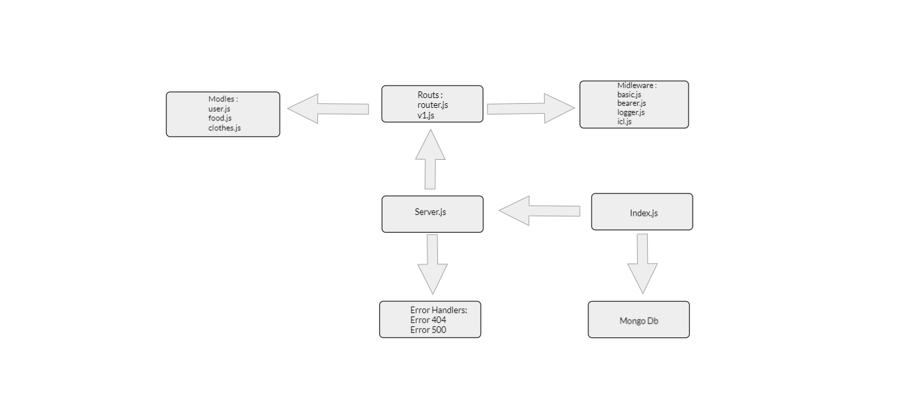

# auth-api
# Heroku :
[Herouko](https://reem-auth-api.herokuapp.com/)

# Github :
[Github](https://github.com/reem-alqurm/auth-api)
# pull request :
[Pull Request](https://github.com/reem-alqurm/auth-api/pulls?q=is%3Apr+is%3Aclosed)
# Github actions :
[Github Actions](https://github.com/reem-alqurm/auth-api/actions)

## UML Diagram :

## WRRC Diagram

